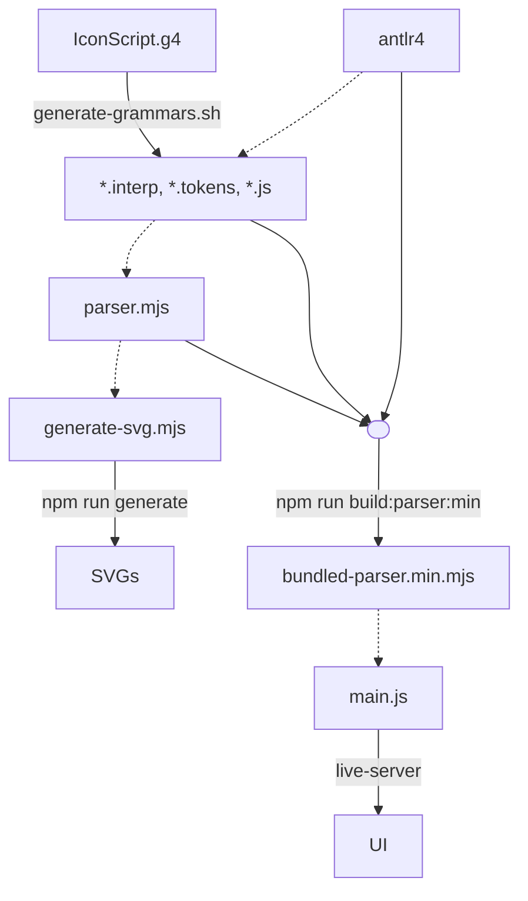

```mermaid
flowchart TD
    gr[IconScript.g4]
    ag[*.interp, *.tokens, *.js]
    an[antlr4]
    bp[parser.mjs]
    bpm[bundled-parser.min.mjs]
    bu([ ])
    gi[generate-svg.mjs]
    mj[main.js]
    gr -->|generate-grammars.sh| ag
    an -.-> ag
    bp -.-> gi
    ag -.-> bp
    bpm -.-> mj
    bp --> bu
    ag --> bu
    an --> bu
    bu -->|npm run build:parser:min| bpm
    mj -->|live-server| UI
    gi -->|npm run generate| SVGs
```